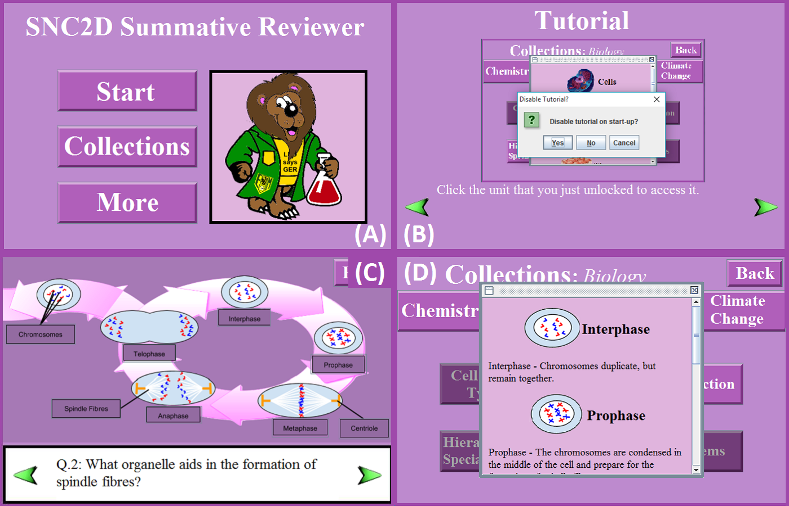

# ICS4U-Group-Project
Highschool Gr. 12 computer science group project (Credits to Kevin Sun, Danny Oh, Chris Zhu). Uploaded is the Java project folder, which can be imported into a Java IDE, and run via 'Main.java'.

## Preview Images:

## Functionality:
This is a simple Java applet developed with the intent to be implemented into a webpage.

### A) The Main Menu:
* The user clicks on the menu navigation buttons to reach the various features of the application

### B) The Tutorial Screens:
* Upon first booting the program, the user navigates a series of screens explaning the function of the program
* These screens are toggleable so that the user does not have to see them on each start-up
  * They can be accessed in the 'More' tab from the Main Menu
